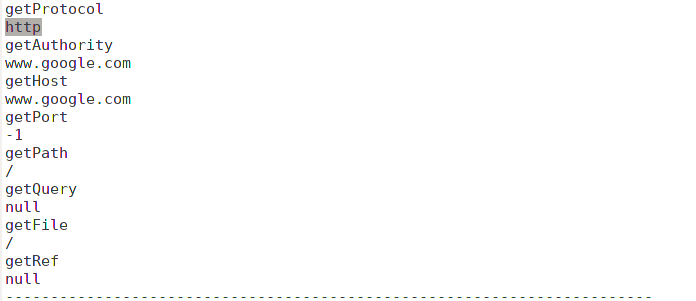
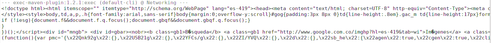
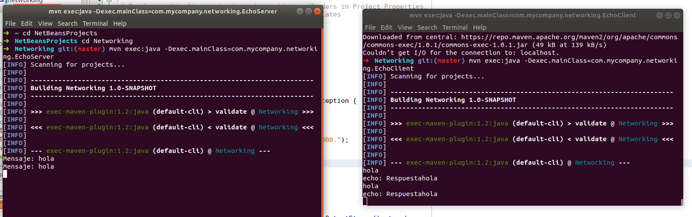
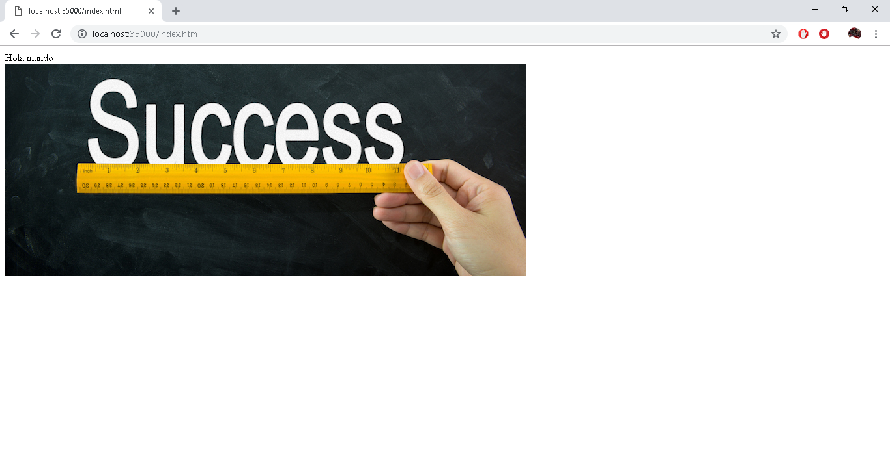

# lab2
Primero utilizamos la pagina google como url y estos son sus componentes 

Siguiendo usando google ahora podemos obserbar que este es el resultado de su contenido, una parte al menos.

En estos pantallazos observamos el programa que le responde lo mismo al cliente.

Server:
Al hacer una petición a index.html observamos la respuesta del server

Datagramas:
hacemos que el server se duerma 5 segundos y siga pidiendo el tiempo

